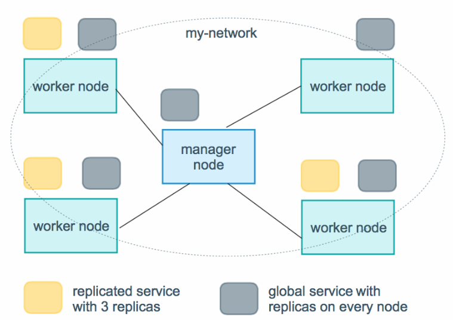
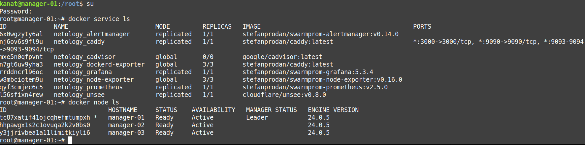
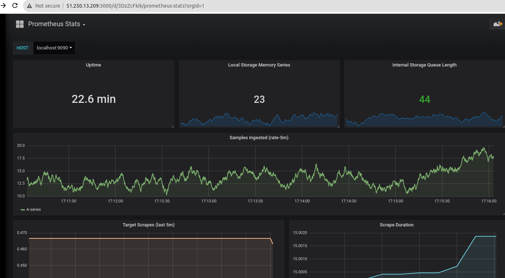
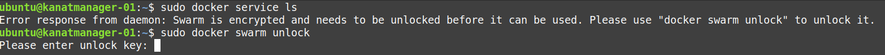

# Домашнее задание к занятию 5. «Оркестрация кластером Docker контейнеров на примере Docker Swarm»
# Задача 1
Дайте письменые ответы на вопросы:
<!--Списко-->
* В чём отличие режимов работы сервисов в Docker Swarm-кластере: replication и global?
    
  Ответ: Для replicated сервисов мы указываем количество идентичных задач, которых хотим запустить. Swarm отслеживает текущее количество запущенных задач и в случае падения какой-либо ноды - запустит задачу на другой (поддерживает заданное количество реплик).
Global сервис запускает одну задачу на каждой ноде. То есть при добавлении в кластер новых нод, глобальный сервис будет запущен и на ней автоматически  


* Какой алгоритм выбора лидера используется в Docker Swarm-кластере?

  Ответ:  Алгоритм поддержания распределенного консенсуса — Raft
  
* Что такое Overlay Network?
  Ответ: Overlay-сеть использует технологию vxlan, которая инкапсулирует layer 2 фреймы в layer 4 пакеты (UDP/IP). При помощи этого действия Docker создает виртуальные сети поверх существующих связей между хостами, которые могут оказаться внутри одной подсети 


# Задача 2
Создайте ваш первый Docker Swarm-кластер в Яндекс Облаке.

Чтобы получить зачёт, предоставьте скриншот из терминала (консоли) с выводом команды:
 ```
 root@manager-01:~# docker node ls
ID                            HOSTNAME     STATUS    AVAILABILITY   MANAGER STATUS   ENGINE VERSION
tc87xatif41ojcqhefmtumpxh *   manager-01   Ready     Active         Leader           24.0.5
hhpawgx1s2c1ovuqa2k2v0bs0     manager-02   Ready     Active                          24.0.5
y3jjrivbea1a11limitkiyli6     manager-03   Ready     Active                          24.0.5
root@manager-01:~# 

 ```
# Задача 3
Создайте ваш первый, готовый к боевой эксплуатации кластер мониторинга, состоящий из стека микросервисов.

Чтобы получить зачёт, предоставьте скриншот из терминала (консоли), с выводом команды:




# Задача 4

  * Выполните на лидере Docker Swarm-кластера команду, указанную ниже, и дайте письменное описание её функционала — что она делает и зачем нужна:
  Ответ: Данная команда нужна для автоблокировки нода предназначено от зашиты злоумышленников . Каждый раз когда ноды перезагружаются нужно вводить ключ шифрования. 

