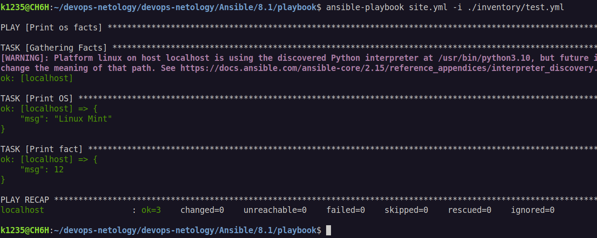
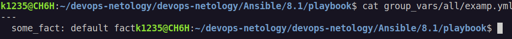
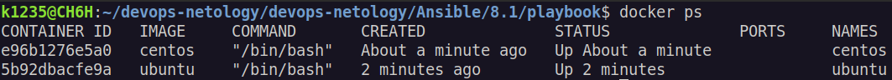
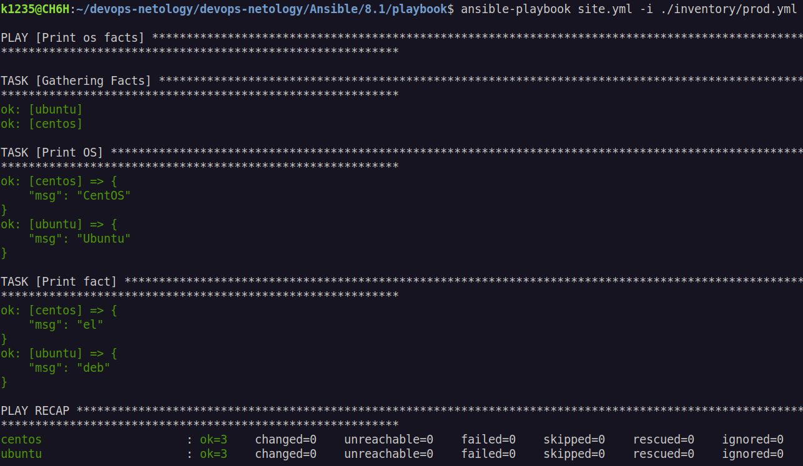

# Домашнее задание к занятию 1 «Введение в Ansible»

# Основная часть

1. Попробуйте запустить playbook на окружении из test.yml, зафиксируйте значение, которое имеет факт some_fact для указанного хоста при выполнении playbook.
   
2. Найдите файл с переменными (group_vars), в котором задаётся найденное в первом пункте значение, и поменяйте его на all default fact.
   
3. Воспользуйтесь подготовленным (используется docker) или создайте собственное окружение для проведения дальнейших испытаний.
   
4. Проведите запуск playbook на окружении из prod.yml. Зафиксируйте полученные значения some_fact для каждого из managed host.
   

### Приложите скриншот входящих правил «Группы безопасности» в ЛК Yandex Cloud или скриншот отказа в предоставлении доступа к preview-версии.


# Задача 2

1. Создайте файл count-vm.tf. Опишите в нём создание двух одинаковых ВМ web-1 и web-2 (не web-0 и web-1) с минимальными параметрами, используя мета-аргумент count loop. Назначьте ВМ созданную в первом задании группу безопасности.(как это сделать узнайте в документации провайдера yandex/compute_instance )

```tf
  variable "server_name" {
  type    = string
  default = "web"

}

data "yandex_compute_image" "ubuntu" {
  family = var.vm_web_image
}


resource "yandex_compute_instance" "platform"  {
  count = var.vm_count
  name        = "${var.server_name}-${count.index+1}"
  platform_id = var.vm_web_platform
  resources {
    cores         = var.vm_web_resources.cores
    memory        = var.vm_web_resources.memory
    core_fraction = var.vm_web_resources.core_fraction
  }
  boot_disk {
    initialize_params {
      image_id = data.yandex_compute_image.ubuntu.image_id
    }
  }
  scheduling_policy {
    preemptible = true
  }
  network_interface {
    subnet_id = yandex_vpc_subnet.develop.id
    security_group_ids = [yandex_vpc_security_group.example.id]
    nat       = true
  }

  metadata = {
    serial-port-enable = 1
    ssh-keys           = "ubuntu:${var.vms_ssh_root_key}"
  }
 }
```

2. Создайте файл for_each-vm.tf. Опишите в нём создание двух ВМ с именами "main" и "replica" разных по cpu/ram/disk , используя мета-аргумент for_each loop. Используйте для обеих ВМ одну общую переменную типа list(object({ vm_name=string, cpu=number, ram=number, disk=number })). При желании внесите в переменную все возможные параметры.

```
resource "yandex_compute_instance" "vm"  {
for_each = {
  for key,value in var.vm_list:
  key => value
}

name        = each.value.vm_name
platform_id = var.vm_web_platform
resources {
  cores         = each.value.cores
  memory        = each.value.memory

  core_fraction = var.vm_web_resources.core_fraction
  }
boot_disk {
  initialize_params {
    image_id = data.yandex_compute_image.ubuntu.image_id
    size          = each.value.disk
  }
}
scheduling_policy {
  preemptible = true
}
network_interface {
  subnet_id = yandex_vpc_subnet.develop.id
  nat       = true
}

metadata = {
  serial-port-enable = 1
  ssh-keys           = "ubuntu:${var.vms_ssh_root_key}"
}
}
```

3. ВМ из пункта 2.2 должны создаваться после создания ВМ из пункта 2.1.

```
resource "yandex_compute_instance" "vm"  {
depends_on = [ yandex_compute_instance.platform ]
for_each = {
  for key,value in var.vm_list:
  key => value
}
```

4. Используйте функцию file в local-переменной для считывания ключа ~/.ssh/id_rsa.pub и его последующего использования в блоке metadata, взятому из ДЗ 2.

```
locals {
metadata = {
  serial-port-enable = 1
  ssh_keys = "ubuntu:${file("~/.ssh/terraform_06-02.pub")}"
}
}
```

5. Инициализируйте проект, выполните код.
   

# Задача 3

1.Создайте 3 одинаковых виртуальных диска размером 1 Гб с помощью ресурса yandex_compute_disk и мета-аргумента count в файле disk_vm.tf.

```
resource "yandex_compute_disk" "disks" {
count = var.vm_count_disk
name  = "disk-${count.index + 1}"
size  = 1
}
```

2. Создайте в том же файле одиночную(использовать count или for_each запрещено из-за задания №4) ВМ c именем "storage" . Используйте блок dynamic secondary_disk{..} и мета-аргумент for_each для подключения созданных вами дополнительных дисков.

```
resource "yandex_compute_instance" "platform_disk" {
name        = "storage"
platform_id = var.vm_web_platform
resources {
  cores         = var.vm_web_resources.cores
  memory        = var.vm_web_resources.memory
  core_fraction = var.vm_web_resources.core_fraction
}
boot_disk {
  initialize_params {
    image_id = data.yandex_compute_image.ubuntu.image_id
  }
}

dynamic "secondary_disk" {
  for_each = yandex_compute_disk.disks
  content {
    disk_id = secondary_disk.value.id
  }
}

```

# Задача 4

1. В файле ansible.tf создайте inventory-файл для ansible. Используйте функцию tepmplatefile и файл-шаблон для создания ansible inventory-файла из лекции. Готовый код возьмите из демонстрации к лекции demonstration2. Передайте в него в качестве переменных группы виртуальных машин из задания 2.1, 2.2 и 3.2, т. е. 5 ВМ.
2. Инвентарь должен содержать 3 группы [webservers], [databases], [storage] и быть динамическим, т. е. обработать как группу из 2-х ВМ, так и 999 ВМ.
3. Выполните код. Приложите скриншот получившегося файла.


Для общего зачёта создайте в вашем GitHub-репозитории новую ветку terraform-03. Закоммитьте в эту ветку свой финальный код проекта, пришлите ссылку на коммит.
Удалите все созданные ресурсы.

https://github.com/Kanat121/devops-netology/tree/main/Terraform/06-03/src
