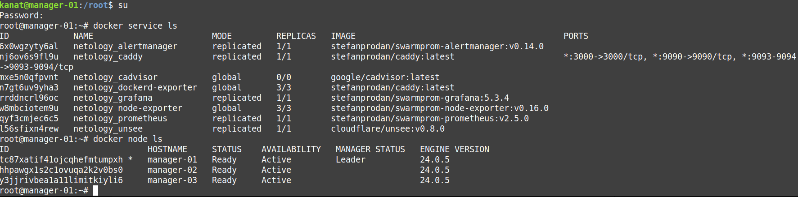
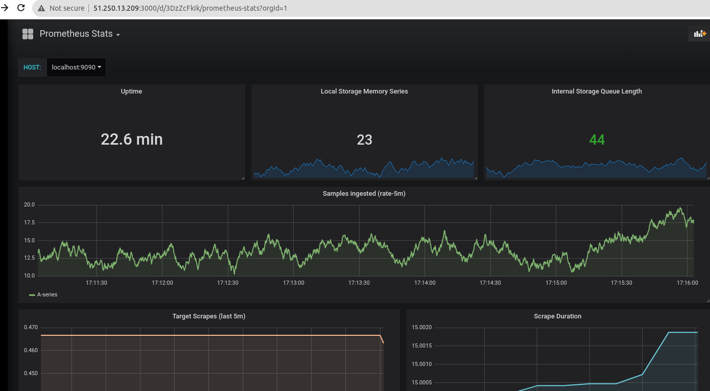
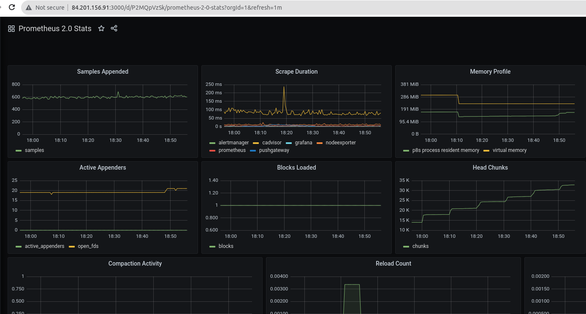

# Домашнее задание к занятию 5. «Оркестрация кластером Docker контейнеров на примере Docker Swarm»
# Задача 1
Дайте письменые ответы на вопросы:
<!--Списко-->
* В чём отличие режимов работы сервисов в Docker Swarm-кластере: replication и global?
* Какой алгоритм выбора лидера используется в Docker Swarm-кластере?
* Что такое Overlay Network?
ответ 


# Задача 2
Создайте ваш первый Docker Swarm-кластер в Яндекс Облаке.

Чтобы получить зачёт, предоставьте скриншот из терминала (консоли) с выводом команды:
 ```
 root@manager-01:~# docker node ls
ID                            HOSTNAME     STATUS    AVAILABILITY   MANAGER STATUS   ENGINE VERSION
tc87xatif41ojcqhefmtumpxh *   manager-01   Ready     Active         Leader           24.0.5
hhpawgx1s2c1ovuqa2k2v0bs0     manager-02   Ready     Active                          24.0.5
y3jjrivbea1a11limitkiyli6     manager-03   Ready     Active                          24.0.5
root@manager-01:~# 

 ```
# Задача 3
Создайте ваш первый, готовый к боевой эксплуатации кластер мониторинга, состоящий из стека микросервисов.

Чтобы получить зачёт, предоставьте скриншот из терминала (консоли), с выводом команды:




# Задача 4

  1. Откройте веб-браузер, зайдите на страницу http://<внешний_ip_адрес_вашей_ВМ>:3000.
  2. Используйте для авторизации логин и пароль из .env-file.
  3. Изучите доступный интерфейс, найдите в интерфейсе автоматически созданные docker-compose-панели с графиками(dashboards).
  4. Подождите 5-10 минут, чтобы система мониторинга успела накопить данные.

 