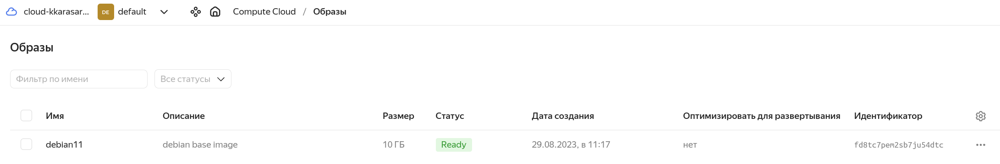
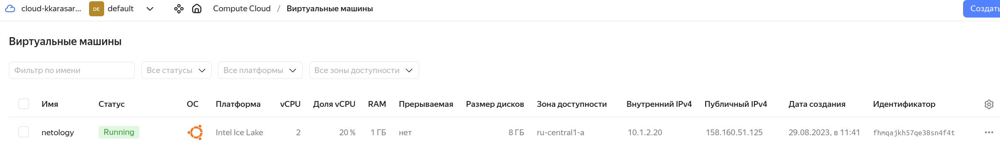
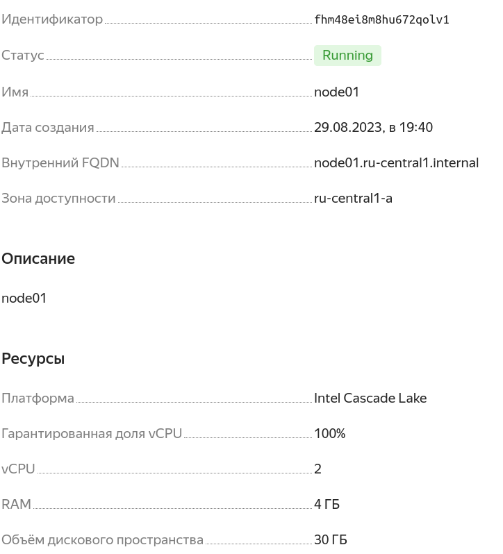
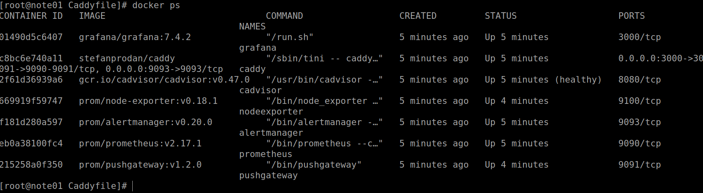

# Домашнее задание к занятию 4. «Оркестрация группой Docker-контейнеров на примере Docker Compose»
# Задача 1
<!--Списко-->
* Создайте собственный образ любой операционной системы (например, debian-11) с помощью Packer версии 1.5.0 
ответ 


# Задача 2

  ## 2.1. Создайте вашу первую виртуальную машину в YandexCloud с помощью web-интерфейса YandexCloud.
 
 ## 2.2 Создайте вашу первую виртуальную машину в YandexCloud с помощью Terraform (вместо использования веб-интерфейса YandexCloud). Используйте Terraform-код в директории (src/terraform).
 
 ```
 k1235@kk005:~/Templates/terraform1$ terraform apply

Terraform used the selected providers to generate the following execution plan. Resource actions are indicated with the following symbols:
  + create

Terraform will perform the following actions:

  # yandex_compute_instance.node01 will be created
  + resource "yandex_compute_instance" "node01" {
      + allow_stopping_for_update = true
      + created_at                = (known after apply)
      + description               = "node01"
      + folder_id                 = "b1gft4ohvq3ph6dd94b5"
      + fqdn                      = (known after apply)
      + gpu_cluster_id            = (known after apply)
      + hostname                  = "node01"
      + id                        = (known after apply)
      + name                      = "node01"
      + network_acceleration_type = "standard"
      + platform_id               = "standard-v2"
      + service_account_id        = (known after apply)
      + status                    = (known after apply)
      + zone                      = "ru-central1-a"

      + boot_disk {
          + auto_delete = true
          + device_name = (known after apply)
          + disk_id     = (known after apply)
          + mode        = (known after apply)

          + initialize_params {
              + block_size  = (known after apply)
              + description = (known after apply)
              + image_id    = "fd87r8o33oua69b0l0ka"
              + name        = (known after apply)
              + size        = 30
              + snapshot_id = (known after apply)
              + type        = "network-ssd"
            }
        }

      + network_interface {
          + index              = (known after apply)
          + ip_address         = (known after apply)
          + ipv4               = true
          + ipv6               = (known after apply)
          + ipv6_address       = (known after apply)
          + mac_address        = (known after apply)
          + nat                = true
          + nat_ip_address     = (known after apply)
          + nat_ip_version     = (known after apply)
          + security_group_ids = (known after apply)
          + subnet_id          = "e9b39kn7auac3vjde732"
        }

      + resources {
          + core_fraction = 100
          + cores         = 2
          + memory        = 4
        }
    }

Plan: 1 to add, 0 to change, 0 to destroy.

Do you want to perform these actions?
  Terraform will perform the actions described above.
  Only 'yes' will be accepted to approve.

  Enter a value: yes

yandex_compute_instance.node01: Creating...
yandex_compute_instance.node01: Still creating... [10s elapsed]
yandex_compute_instance.node01: Still creating... [20s elapsed]
yandex_compute_instance.node01: Still creating... [30s elapsed]
yandex_compute_instance.node01: Still creating... [40s elapsed]
yandex_compute_instance.node01: Still creating... [50s elapsed]
yandex_compute_instance.node01: Still creating... [1m0s elapsed]
yandex_compute_instance.node01: Creation complete after 1m0s [id=fhm48ei8m8hu672qolv1]

 ```
      
    

# Задача 3
## С помощью Ansible и Docker Compose разверните на виртуальной машине из предыдущего задания систему мониторинга на основе Prometheus/Grafana. Используйте Ansible-код в директории (src/ansible).



# Задача 4

  1. Откройте веб-браузер, зайдите на страницу http://<внешний_ip_адрес_вашей_ВМ>:3000.
  2. Используйте для авторизации логин и пароль из .env-file.
  3. Изучите доступный интерфейс, найдите в интерфейсе автоматически созданные docker-compose-панели с графиками(dashboards).
  4. Подождите 5-10 минут, чтобы система мониторинга успела накопить данные.

 К сожаленю я так не смог открыть страницу хотя все контейнеры запустились.