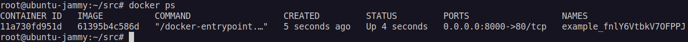

# Задача 1
    1.2 Изучите файл .gitignore. В каком terraform-файле, согласно этому .gitignore, допустимо сохранить личную, секретную информацию?
    ответ: personal.auto.tfvars.

    1.3 Выполните код проекта. Найдите в state-файле секретное содержимое созданного ресурса random_password, пришлите в качестве ответа конкретный ключ и его значение.
     ответ:

    1.4 Раскомментируйте блок кода, примерно расположенный на строчках 29–42 файла main.tf. Выполните команду terraform validate. Объясните, в чём заключаются намеренно допущенные ошибки. Исправьте их.

    
  
    
    1.5 Выполните код. В качестве ответа приложите: исправленный фрагмент кода и вывод команды docker ps.

    1.6 Замените имя docker-контейнера в блоке кода на hello_world. Не перепутайте имя контейнера и имя образа. Мы всё ещё продолжаем использовать name = "nginx:latest". Выполните команду terraform apply -auto-approve. Объясните своими словами, в чём может быть опасность применения ключа -auto-approve. В качестве ответа дополнительно приложите вывод команды docker ps.
    
apply -auto-approve - опция позволяющую Terraform применить план без запроса подтверждения.  

    1.7 Уничтожьте созданные ресурсы с помощью terraform. Убедитесь, что все ресурсы удалены. Приложите содержимое файла terraform.tfstate.

 
    1.8 Объясните, почему при этом не был удалён docker-образ nginx:latest. Ответ обязательно подкрепите строчкой из документации terraform провайдера docker. (ищите в классификаторе resource docker_image )

  Ответ: keep_locally(Boolean) Если true, образ Docker не будет удален при операции destroy. Если это значение ложно, оно удалит изображение из локального хранилища докера при операции destroy.

